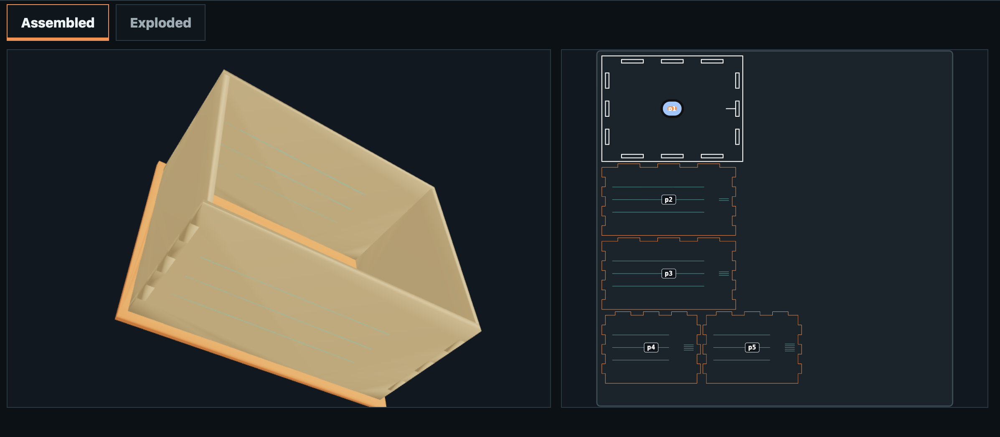
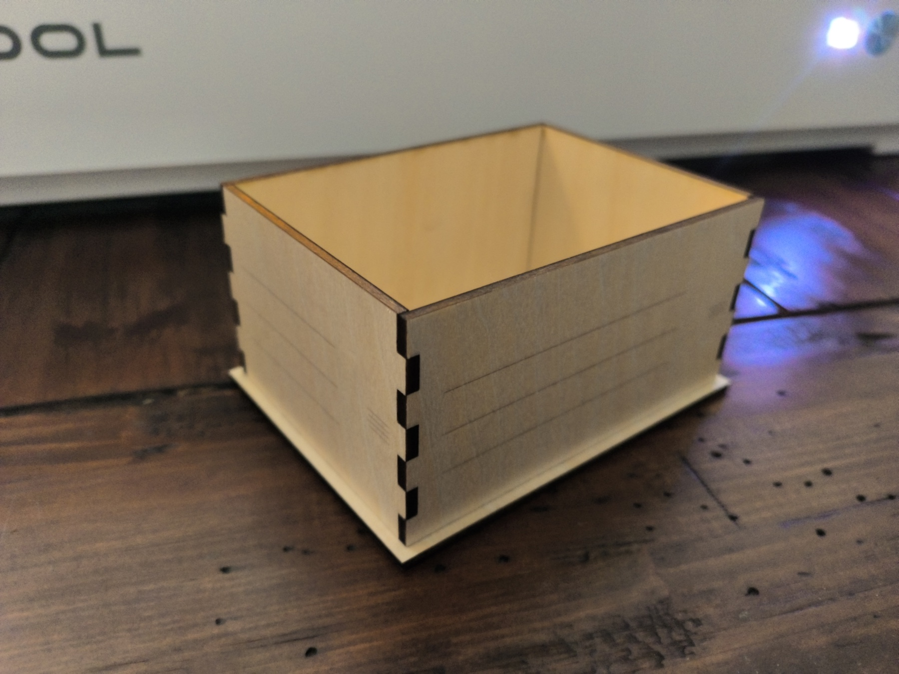
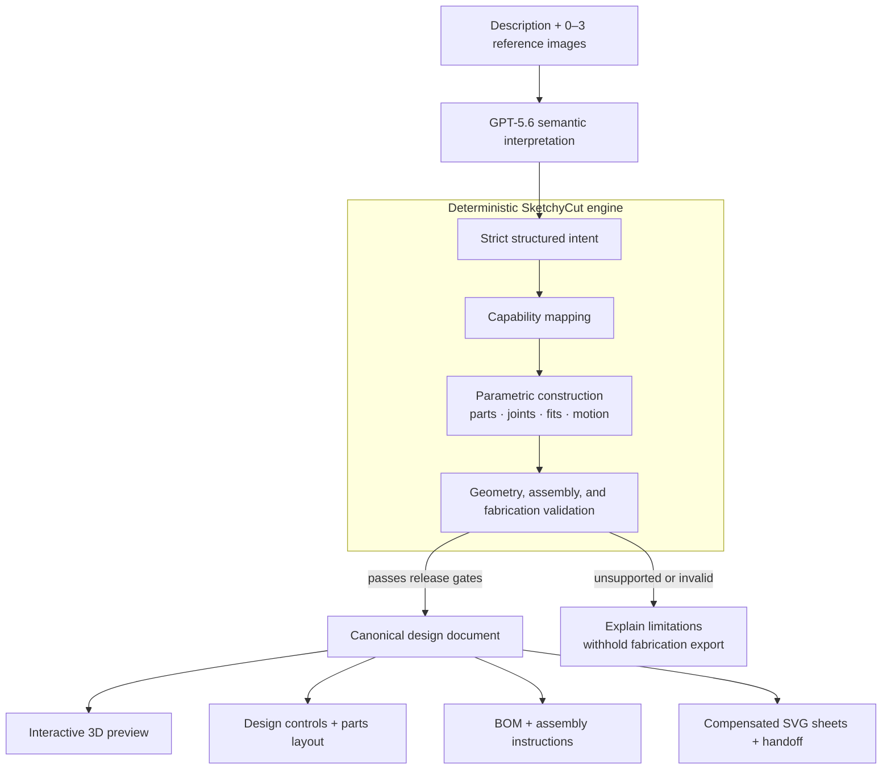

# SketchyCut

<p align="center">
  <a href="https://www.youtube.com/watch?v=jsq_vaQXklU">
    
  </a>
</p>

<p align="center"><a href="https://www.youtube.com/watch?v=jsq_vaQXklU"><strong>Watch the SketchyCut project video</strong></a></p>

<p align="center">
  
  
</p>

**Describe your 3D idea, provide 1–3 images, and SketchyCut will provide an SVG cut file that you can use for laser cutting, then piece together into a 3D structure.**

[Try SketchyCut](https://sketchycut.earlyspark.com/) · [Explore the examples](https://sketchycut.earlyspark.com/examples) · [How it works](https://sketchycut.earlyspark.com/about)

## Why I built it

Have you ever looked at something and thought, “How did they engineer that?”—followed by, “I wish I could design and make something like it”?

I have. The difficult part is the step between picturing an object and having pieces that actually fit together. That step usually demands CAD modeling, joinery knowledge, material measurements, cut-width compensation, sheet layout, and assembly planning.

SketchyCut is my attempt to make that expertise approachable. A maker describes an object and can add up to three reference images. SketchyCut interprets the idea, chooses a construction it can support, and produces one connected project: an interactive 3D preview, editable dimensions, a bill of materials, assembly instructions, validation findings, and—when every release gate passes—plain SVG sheets for laser cutting.

Existing image-to-SVG workflows can prepare a 2D image for cutting or engraving. The gap I wanted to address is different: how can software interpret a custom idea as a three-dimensional construction and derive the separate parts needed to assemble it?

This is not an “AI draws an SVG” tool. The model handles ambiguity; deterministic code handles precision.

## The key idea

GPT-5.6 interprets **what the maker means**. It may identify semantic bodies, relationships, requirements, proportions, reference observations, and visual intent.

It does **not** generate cut contours, exact dimensions, joints, transforms, kerf offsets, machine settings, or validation claims. SketchyCut's deterministic construction engine owns those decisions.



Every output is projected from the same versioned canonical design document. The 3D preview is not a hand-authored approximation of a different cut file: parts, joints, meshes, fabrication paths, BOM entries, and instructions share stable identities and deterministic hashes. If a core request is unsupported or deterministic validation fails, SketchyCut explains the limitation and withholds fabrication export.

## What you can do

- Describe a project in natural language and optionally add zero to three ordered JPEG, PNG, or WebP references.
- Review what GPT-5.6 observed, what deterministic code realized, what was simplified, and what remains unsupported or uncertain.
- Explore one continuously connected **Preview**, **Design**, **Build**, and **Fabricate** workspace.
- Inspect assembled, moving, and exploded 3D states linked to the exact parts and sheets.
- Adjust exact dimensions, material thickness, fit, and supported motif placement locally with no additional model call.
- Download a BOM, parts legend, numbered instructions, validation evidence, and eligible SVG sheets.

Hackathon judges have special access to try the full live demo.

## Current release and evidence

SketchyCut currently demonstrates a shared glue-free construction vocabulary through three box-shaped proof targets:

| Construction | Current status |
| --- | --- |
| Open-top Basic | Fabrication-enabled when deterministic validation and release gates pass |
| Retained-pin Hinged | Interactive deterministic design preview; fabrication export currently withheld |
| Captured Sliding | Interactive deterministic design preview; fabrication export currently withheld |

Basic, Hinged, and Sliding are proof targets for reusable construction operators, not three templates or the intended boundary of the product. Off-family fixtures exercise the same registered operators to guard against family-name selection and fixture-specific geometry.

The current Basic geometry and fabrication path are software-validated. An earlier Basic artifact was physically cut and assembled without glue, but required excessive insertion force. The current adjusted fabrication bytes have not yet completed matching cut-and-assembly verification. Hinged and Sliding remain preview-only after their physical builds exposed construction problems that software checks alone did not justify overlooking.

Accordingly, SketchyCut distinguishes:

- **Concept only:** the request is understood, but export is withheld.
- **Fabrication candidate:** deterministic geometry, assembly, and export checks pass; physical fit is not yet claimed.
- **Cut, assembly, or motion verified:** reserved for evidence tied to the exact artifact hash.

A convincing render is not treated as proof that wood has been cut, assembled, or cycled successfully.

## How Codex and GPT-5.6 were used

### GPT-5.6 in the product

The live interpretation layer uses GPT-5.6 Sol for one constrained multimodal request. Its response must pass a strict schema and contains compact semantic intent—not fabrication geometry. Deterministic code then authorizes evidence, resolves measurements and scoped conflicts, maps requirements to registered capabilities, compiles exact construction, validates the result, and decides whether export is allowed.

Model, prompt and schema identities, request status, latency, token usage, cache provenance, and cost exposure are recorded. Ambiguous post-dispatch transport failures remain potentially billed rather than being silently retried or recorded as zero cost.

### Codex during development

During brainstorming and architecture work, I used GPT-5.6 Sol at Ultra reasoning to work through the central design problem: combining a model capable of understanding a user's words and images with a deterministic system capable of turning that intent into exact mathematics. For implementation, I used GPT-5.6 Sol at Extra High reasoning. I also used GPT-5.6 models to question the code and architecture, understand model capabilities, and prepare bounded milestone goals that Codex could execute and verify over longer work sessions.

Codex helped me:

- investigate prior art and test geometry-library behavior before implementation;
- design strict schemas and the boundary between semantic interpretation and deterministic fabrication authority;
- implement and test versioned construction operators, polygon processing, nesting, motion proofs, canonical projections, and the shared product workspace;
- build network-disabled fixtures, anti-overfitting checks, golden matrices, architecture guards, privacy checks, production builds, and browser tests;
- diagnose failures from live model evaluations and physical builds without rewriting failed evidence into success;
- maintain an evidence trail separating human decisions, model behavior, deterministic validation, and physical observations.

I remained responsible for product direction and acceptance decisions. Among the choices I made were forbidding model-authored fabrication geometry, keeping assembly glue-free, and requiring off-family operator proofs.

The collaboration worked best as a loop: I set the physical and product constraints, reviewed alternatives and evidence, corrected assumptions, and decided what could be claimed; Codex helped turn those decisions into narrow contracts, implementation, and repeatable verification.

## The hardest engineering challenge

The largest risk was building a polished collection of examples that could not generalize—a hidden template selector surrounded by heuristics.

I addressed that risk in three ways:

1. Designs are represented as semantic bodies, interfaces, requirements, and relationships rather than product names.
2. A registry of general-purpose parametric construction operators generates geometry from explicit constraints instead of selecting fixed drawings.
3. Operators must also pass deliberately off-family proofs. For example, the same captured-slide capability used by the public Sliding preview is exercised on a drawer-in-sleeve fixture, through the same compiler, validators, and projections. Architecture guards reject missing fixtures, product-family selectors in deterministic core code, unregistered operators, and named/off-family version drift.

These tests do not prove universal construction or physical reliability. They provide bounded evidence that the implemented vocabulary is reusable beyond the public examples.

## Architecture highlights

- TypeScript and strict Zod contracts at system boundaries
- Integer-micrometre internal geometry with millimetre-based public outputs
- Versioned, registered construction operators rather than product-family classifiers
- Ideal physical geometry kept separate from compensated fabrication paths
- Polygon Boolean and offset operations behind a narrow geometry-kernel adapter
- Operator-owned 2.5D proofs for supported revolute and prismatic motion
- One canonical document projected into Three.js meshes, SVG, BOM, legend, instructions, validation, and provenance
- Server-only OpenAI transport, authentication, quotas, persistence, cache, and append-only attempt accounting
- Exact semantic caching with deterministic reconciliation, compilation, and validation rerun on every hit
- Root-bundle and architecture guards that keep the public landing page and client output free of the live interpretation and secret-bearing server stack

## What is next

SketchyCut's long-term direction is a larger deterministic construction vocabulary that can represent more shapes and genuinely functioning sheet-built mechanisms without sacrificing generality, mathematical correctness, or fabrication reliability.

The immediate work is intentionally evidence-driven: expand supported geometry through registered operators with off-family and physical proof. Future ambitions include deterministic profiles, retained layered constructions, gears, cranks, cams, linkages, carousels, and automata—but none are advertised as fabrication capabilities until their own software and physical gates pass.

## Run locally

### Requirements

- Node.js 24 or later
- npm

Install the pinned dependencies:

```bash
npm ci
```

### Safe fixture mode

The easiest way to evaluate the complete interface locally is fixture mode. It disables paid and durable clients, uses in-memory state, and makes no OpenAI request:

```bash
npm run dev:fixtures
```

Open [http://localhost:3000](http://localhost:3000), expand **Judge Access** in the footer, and enter:

```text
sketchycut-fixture-access
```

The public `/examples` route also provides the Basic, Hinged, and Sliding progression without authentication or model calls.

### Live mode

```bash
npm run dev
```

Live mode intentionally refuses to start unless its server-only OpenAI, durable Upstash, access-verifier, session-signing, and interpretation-prompt configuration is complete. Starting the server does not make a model request; an explicit **Generate** action authorizes one request. Secrets and the runtime interpretation prompt must remain local and must never be placed in client-visible environment variables or committed files.

## Verify the project

The ordinary verification path is hermetic and network-disabled:

```bash
npm run verify
```

It runs type checking, zero-warning lint, architecture and source guards, unit and golden tests, deterministic payload checks, a production build, emitted-bundle audits, and Chromium end-to-end tests.

Useful focused commands:

```bash
npm run typecheck
npm run lint
npm test
npm run test:e2e
npm run build
```

Live model evaluation, connected persistence conformance, and physical observation verification are deliberately separate from `npm run verify`; none should be mistaken for ordinary unit-test activity.

## Fabrication scope

The current registered workflow targets nominal 3 mm laser-grade basswood plywood, with birch plywood available as a secondary provisional stock, and glue-free assembly. The primary export is plain millimetre-based SVG for the registered xTool M2 20W blue-light flat-surface workflow in xTool Studio Desktop 1.7.30 or later.

SVG colors and groups are selection aids only. They do not assign Cut, Score, Engrave, output state, processing order, power, speed, passes, or focus. SketchyCut owns fabrication-path compensation, so downstream xTool Studio Kerf Offset must remain off/0 for compensated product paths. Machine setup, framing, supervision, fire safety, recipe qualification, and physical fit remain the operator's responsibility.

SketchyCut does not claim strength, durability, child safety, food safety, universal machine compatibility, or reliable fabrication outside recorded evidence.

## Built with

TypeScript, Next.js, React, React Three Fiber, Three.js, Zod, Clipper2, Earcut, Sharp, Vitest, Playwright, Upstash Redis, the OpenAI API with GPT-5.6, and Codex.

## License

MIT
